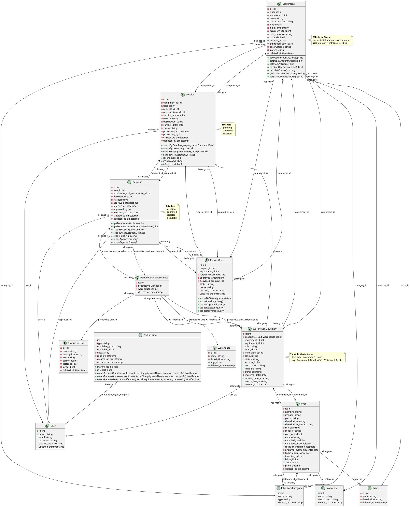
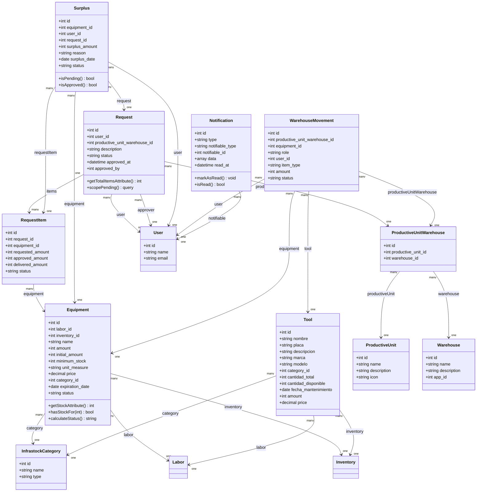

# Diagrama de Clases - Módulo INFRASTOCK

## Diagrama UML en PlantUML



## Descripción de las Clases

### 1. **Equipment (Insumo/Equipo)**
Representa los insumos o equipos del inventario. Calcula automáticamente el stock disponible basándose en movimientos de almacén.

**Atributos clave:**
- `amount`: Cantidad actual
- `initial_amount`: Cantidad inicial
- `stock`: Stock disponible (calculado)
- `status`: Estado calculado automáticamente (disponible, agotado, crítico, bajo_stock, vencido)

### 2. **Tool (Herramienta)**
Representa las herramientas del inventario. Similar a Equipment pero para herramientas.

### 3. **InfrastockCategory (Categoría)**
Clasifica tanto insumos como herramientas por tipo.

### 4. **Request (Solicitud)**
Representa una solicitud de insumos realizada por un usuario.

**Estados:** pending, approved, rejected, delivered

### 5. **RequestItem (Item de Solicitud)**
Cada insumo solicitado dentro de una Request. Permite aprobar/rechazar cantidades específicas.

### 6. **Surplus (Sobrante)**
Registra los sobrantes de insumos entregados que no fueron utilizados.

### 7. **WarehouseMovement (Movimiento de Almacén)**
Registra todos los movimientos de inventario (préstamos, devoluciones, entregas).

**Tipos:**
- `item_type`: 'equipment' o 'tool'
- `role`: 'Préstamo', 'Devolución', 'Entrega', 'Recibe'

### 8. **ProductiveUnit (Unidad Productiva)**
Representa las áreas productivas del centro (Agroindustria, Ganadería, etc.).

### 9. **Warehouse (Almacén)**
Representa los almacenes o bodegas donde se guardan los insumos.

### 10. **ProductiveUnitWarehouse (Relación Unidad-Almacén)**
Tabla intermedia que relaciona unidades productivas con almacenes.

### 11. **Notification (Notificación)**
Sistema de notificaciones polimórfico para usuarios.

### 12. **User (Usuario)**
Modelo de usuario del sistema principal (App\Models\User).

## Relaciones Principales

1. **Equipment ↔ InfrastockCategory**: Muchos a Uno
2. **Request ↔ RequestItem**: Uno a Muchos
3. **Request ↔ User**: Muchos a Uno (solicitante y aprobador)
4. **RequestItem ↔ Equipment**: Muchos a Uno
5. **Surplus ↔ Request**: Muchos a Uno
6. **WarehouseMovement ↔ Equipment/Tool**: Muchos a Uno (polimórfico)
7. **ProductiveUnitWarehouse**: Relación intermedia entre ProductiveUnit y Warehouse

## Patrones de Diseño Utilizados

1. **Soft Deletes**: La mayoría de entidades usan borrado lógico
2. **Accessors/Mutators**: Equipment calcula stock y status automáticamente
3. **Scopes**: Request y RequestItem tienen scopes para filtrar por estado
4. **Polymorphic Relations**: Notification usa relaciones polimórficas
5. **Factory Pattern**: Algunas entidades tienen factories para testing

## Herramientas para Visualizar

Puedes visualizar este diagrama usando:

1. **PlantUML Online**: http://www.plantuml.com/plantuml/
2. **VS Code**: Extensión "PlantUML"
3. **IntelliJ IDEA**: Plugin PlantUML
4. **Draw.io**: Importar código PlantUML
5. **Visual Studio**: Extensión PlantUML

## Versión en Mermaid (Alternativa)



## Diagrama Simplificado de Relaciones

```
┌─────────────────┐
│   User          │
└────────┬────────┘
         │
         │ 1
         │
    ┌────▼─────────────────────────────────────┐
    │         Request                          │
    │  - status: pending/approved/rejected    │
    └────┬─────────────────────────────────────┘
         │ 1
         │
         │ *
    ┌────▼──────────────┐
    │   RequestItem     │
    │  - requested_amount│
    │  - approved_amount │
    └────┬──────────────┘
         │ *
         │
         │ 1
    ┌────▼──────────────┐
    │   Equipment       │
    │  - stock (calc)   │
    │  - status (calc)  │
    └────┬──────────────┘
         │ *
         │
         │ 1
    ┌────▼──────────────┐
    │ InfrastockCategory│
    └───────────────────┘

┌──────────────────────┐
│  ProductiveUnit      │
└──────────┬───────────┘
           │ 1
           │
           │ *
┌──────────▼──────────────────┐
│ ProductiveUnitWarehouse     │
└──────────┬──────────────────┘
           │ 1
           │
           │ 1
┌──────────▼──────────┐
│   Warehouse         │
└─────────────────────┘
```

## Exportar a Otros Formatos

### PlantUML
Para exportar a PNG, SVG o PDF, puedes usar:

```bash
# Con PlantUML instalado
java -jar plantuml.jar DIAGRAMA_CLASES.md

# O usar el servidor online
# Copia el código entre @startuml y @enduml a:
# http://www.plantuml.com/plantuml/uml/
```

### Mermaid
Para visualizar el diagrama Mermaid:
- **GitHub/GitLab**: Se renderiza automáticamente en archivos .md
- **Online**: https://mermaid.live/
- **VS Code**: Extensión "Markdown Preview Mermaid Support"

### Herramientas Recomendadas

1. **PlantUML Online**: http://www.plantuml.com/plantuml/
2. **Mermaid Live Editor**: https://mermaid.live/
3. **Draw.io**: https://app.diagrams.net/ (importar PlantUML)
4. **Lucidchart**: https://www.lucidchart.com/
5. **Visual Paradigm**: https://www.visual-paradigm.com/
